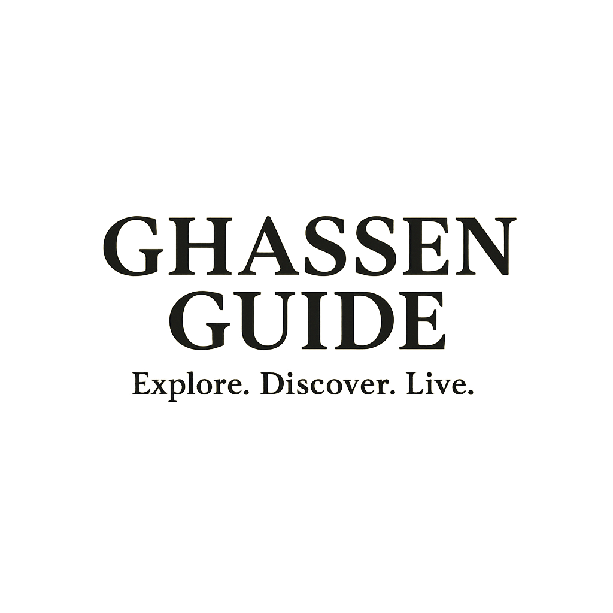

# Ghassen Travel Guide

A modern, full-stack travel guide website for Djerba, Tunisia, featuring activity booking, multi-language support, and an admin dashboard.



## 🌟 Features

### User Features
- 🏖️ **Activity Browsing**: Explore various activities in Djerba (quad biking, jet skiing, camel riding, etc.)
- 🌍 **Multi-language Support**: Available in 7 languages (French, English, Arabic, Italian, Polish, German, Spanish)
- 💱 **Multi-currency**: Support for TND, EUR, USD, GBP, PLN, CAD, CHF
- 📱 **Responsive Design**: Works seamlessly on desktop, tablet, and mobile
- 🎬 **Video Showcase**: Beautiful video presentations in iPhone-style frames
- 📝 **Reservation System**: Easy booking with form validation
- ⭐ **Activity Reviews**: View and submit reviews for activities

### Admin Features
- 🔐 **Secure Authentication**: Admin login system
- 📊 **Analytics Dashboard**: View statistics, revenue, and trends
- 🎯 **Activity Management**: Full CRUD operations for activities
- 📋 **Reservation Management**: View, filter, and update reservation status
- 🖼️ **Image Upload**: Upload activity images directly from the admin panel

## 🚀 Tech Stack

### Frontend
- **React** with Vite
- **React Router** for navigation
- **Framer Motion** for animations
- **Recharts** for data visualization
- **i18next** for internationalization
- **Axios** for API calls
- **Lucide React** for icons

### Backend
- **Node.js** with Express
- **Multer** for file uploads
- **CORS** enabled
- JSON file-based data storage

## 📦 Installation

### Prerequisites
- Node.js (v14 or higher)
- npm or yarn

### Backend Setup
```bash
cd backend
npm install
npm run dev
```
The backend will run on `http://localhost:3001`

### Frontend Setup
```bash
cd frontend
npm install
npm run dev
```
The frontend will run on `http://localhost:5173`

## 🔧 Configuration

### Admin Credentials
- **Email**: `ghassen2025@gmail.com`
- **Password**: `ghassen2025guide@@`

### Environment Variables
No environment variables required for local development. The app uses hardcoded API URLs for simplicity.

## 📁 Project Structure

```
ghassen-travel-guide/
├── backend/
│   ├── data/              # JSON data files
│   ├── routes/            # API routes
│   ├── utils/             # Utility functions
│   ├── uploads/           # Uploaded images
│   └── server.js          # Express server
├── frontend/
│   ├── src/
│   │   ├── assets/        # Images, videos, logos
│   │   ├── components/    # React components
│   │   │   ├── admin/     # Admin dashboard components
│   │   │   └── ...        # Public components
│   │   ├── utils/         # Utility functions
│   │   ├── i18n.js        # Translation configuration
│   │   ├── App.jsx        # Main app component
│   │   └── main.jsx       # Entry point
│   └── package.json
└── README.md
```

## 🎨 Features in Detail

### Preloader
- Animated logo with rotating guard
- Smooth fade-out transition
- White background with elegant design

### Navbar
- Sticky navigation with scroll effect
- Language selector with 7 languages
- Currency selector with 7 currencies
- Logo integration
- Mobile-responsive menu

### Activities
- Dynamic activity cards with images
- Price conversion based on selected currency
- Smooth animations on scroll
- Click to view details

### Admin Dashboard
- Modern purple gradient theme
- Interactive charts (Recharts)
- Real-time statistics
- Reservation status management
- Activity CRUD operations with image upload

## 🌐 Supported Languages
- 🇫🇷 Français (French)
- 🇬🇧 English
- 🇸🇦 العربية (Arabic)
- 🇮🇹 Italiano (Italian)
- 🇵🇱 Polski (Polish)
- 🇩🇪 Deutsch (German)
- 🇪🇸 Español (Spanish)

## 💰 Supported Currencies
- TND (Tunisian Dinar)
- EUR (Euro)
- USD (US Dollar)
- GBP (British Pound)
- PLN (Polish Zloty)
- CAD (Canadian Dollar)
- CHF (Swiss Franc)

## 📸 Screenshots

### Home Page
Beautiful hero section with Djerba beach imagery and call-to-action button.

### Activities
Grid layout showcasing all available activities with images, prices, and durations.

### Admin Dashboard
Comprehensive dashboard with analytics, charts, and management tools.

## 🤝 Contributing

This is a private project for Ghassen Travel Guide. For any inquiries, please contact:
- **Email**: contact@ghassenguide.com
- **Phone**: +216 20 642 540

## 📄 License

All rights reserved © 2025 Ghassen Travel Guide

## 🎯 Future Enhancements

- [ ] Database integration (MongoDB/PostgreSQL)
- [ ] Payment gateway integration
- [ ] Email notifications for reservations
- [ ] Advanced search and filtering
- [ ] User accounts and booking history
- [ ] Real-time availability calendar
- [ ] Social media integration
- [ ] SEO optimization

## 👨‍💻 Developer

Developed by [Loomens](https://www.loomens.com/)

---

**Explore. Discover. Live.** 🌴
